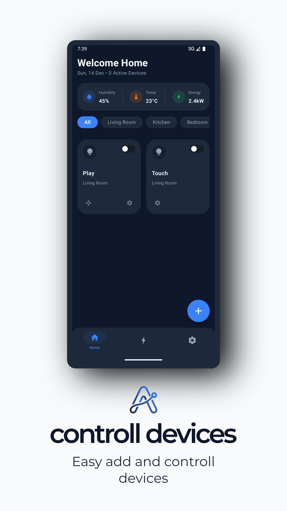
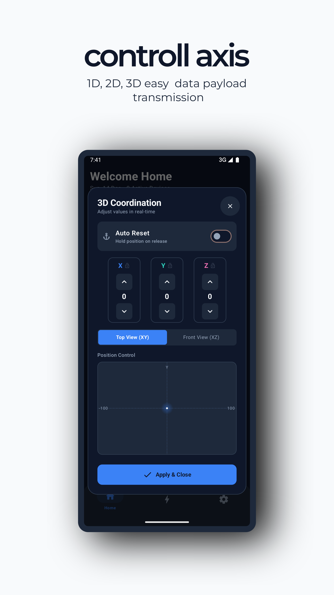
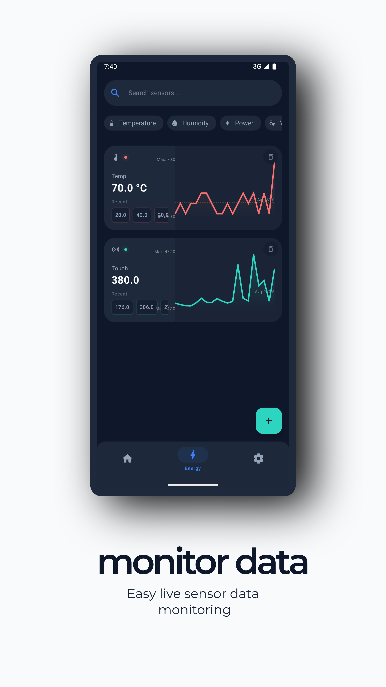
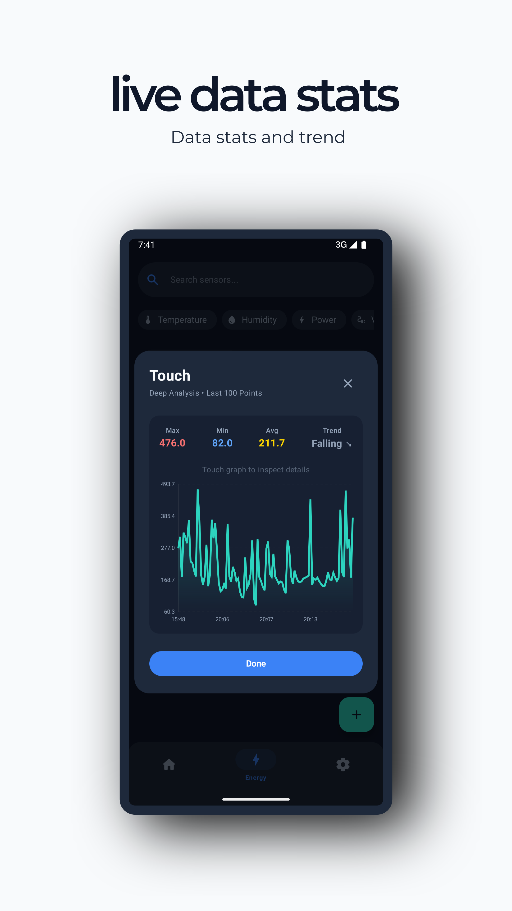

# Home IoT (Android Jetpack Kotlin)

MQTT based android application controller and live data analysis
Downlaod: https://play.google.com/store/apps/details?id=com.pankajkumarrout.homeiot
---

## 🚀 Features
- Easy Controll devices
- 2d and 3d controller varients
- Live data

---

## 🛠 Tech Stack
- Kotlin
- Jetpack compose
- Room

---

## 📸 Screenshots

  
  
  
  

---

## ⚙️ Download
https://play.google.com/store/apps/details?id=com.pankajkumarrout.homeiot

## 📌 Future Improvements

- ROS 2 intigration
- Cloud scheduling

## 👤 Author

Pankaj Kumar Rout

## Why This Project Matters
This project demonstrates:
- MQTT
- IoT
- Embedded

